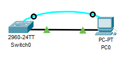
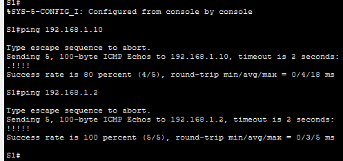
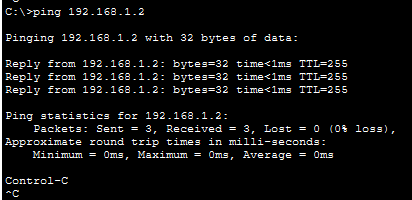
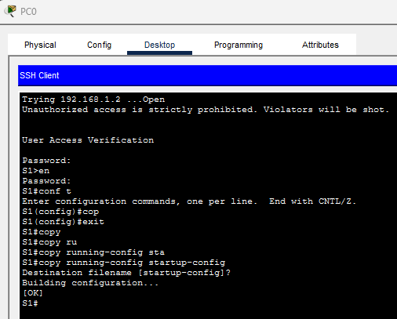
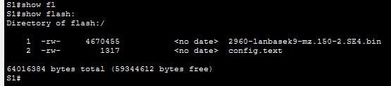
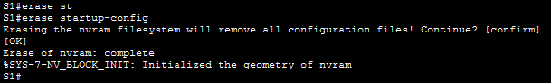
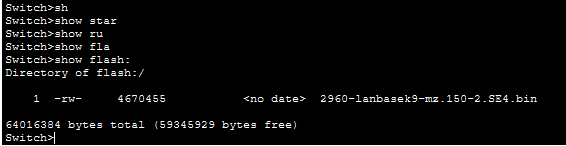

# Лабораторная работа. Базовая настройка коммутатора

### Топология



### Таблица адресации

|Устройство|Интерфейс|IP адрес / префикс|
|--|--|--|
|S1|VLAN 1|192.168.1.2/24|
|PC-A|NIC|192.168.1.10/24|

### Задачи
#### Часть 1. Проверка конфигурации коммутатора по умолчанию
#### Часть 2. Создание сети и настройка основных параметров устройства
- Настройте базовые параметры коммутатора.
- Настройте IP-адрес для ПК.
#### Часть 3. Проверка сетевых подключений
- Отобразите конфигурацию устройства.
- Протестируйте сквозное соединение, отправив эхо-запрос.
- Протестируйте возможности удаленного управления с помощью Telnet.

### Общие сведения/сценарий

На коммутаторах Cisco нужно настроить особый IP-адрес, который называют виртуальным интерфейсом коммутатора (SVI). SVI или адрес управления нужно использовать для удаленного доступа к коммутатору в целях отображения или настройки параметров. Если для SVI сети VLAN 1 назначен IP-адрес, то по умолчанию все порты в сети VLAN 1 имеют доступ к IP-адресу управления SVI.

В ходе данной лабораторной работы предстоит построить простую топологию, используя Ethernet-кабель локальной сети, и получить доступ к коммутатору Cisco, используя консольное подключение и методы удаленного доступа. Перед настройкой базовых параметров коммутатора нужно проверить настройки коммутатора по умолчанию. В число таких основных параметров коммутации входят имя устройства, описание интерфейса, локальные пароли, объявление дня (MOTD), IP-адрес и статический MAC-адрес. Необходимо также показать использование IP-адреса управления для удаленного управления коммутатором. Топология включает один коммутатор и один узел с использованием только портов Ethernet и консольных портов.

### Использованные ресурсы

- 1 коммутатор (Cisco 2960)
- 1 ПК (под управлением Windows с программой эмуляции терминала, например, Tera Term)
- 1 консольный кабель для настройки устройства на базе Cisco IOS через консольный порт.
- 1 кабель Ethernet, подлкюченный к ge0/6 и к PC.

## Часть 1. Создание сети и проверка настроек коммутатора по умолчанию
В первой части лабораторной работы вам предстоит настроить топологию сети и проверить настройку коммутатора по умолчанию.


### Шаг 1. Создание сети согласно топологии

1.	Подсоедините консольный кабель, как показано в топологии. На данном этапе не подключайте кабель Ethernet компьютера PC-A.
**Примечание**. При использовании Netlab отключите интерфейс F0/6 на коммутаторе S1. Это имеет такой же эффект, как отсоединение компьютера PC-A от коммутатора S1.

1.	Установите консольное подключение к коммутатору с компьютера PC-A с помощью Tera Term или другой программы эмуляции терминала.

**Вопрос**:
Почему нужно использовать консольное подключение для первоначальной настройки коммутатора? Почему нельзя подключиться к коммутатору через Telnet или SSH?
**Ответ**:
Для работы по SSH и Telnet необходимо использовать L3 (IP), но на "пустом" коммутаторе такой настройки нет. Для первоначальной настройки в Cisco доступен только Serial порт. При этом некоторые вендоры позволяют подключаться по L2 (MAC), как пример использование ROMON в mikrotik, но Cisco не имеет такого аналога.

### Шаг 2. Проверьте настройки коммутатора по умолчанию.
На данном этапе вам нужно проверить такие параметры коммутатора по умолчанию, как текущие настройки коммутатора, данные IOS, свойства интерфейса, сведения о VLAN и флеш-память.

Все команды IOS коммутатора можно выполнять из привилегированного режима. Доступ к привилегированному режиму нужно ограничить с помощью пароля, чтобы предотвратить неавторизованное использование устройства — через этот режим можно получить прямой доступ к режиму глобальной конфигурации и командам, используемым для настройки рабочих параметров. Пароли можно будет настроить чуть позже.

К привилегированному набору команд относятся команды пользовательского режима, а также команда configure, при помощи которой выполняется доступ к остальным командным режимам. Введите команду enable, чтобы войти в привилегированный режим EXEC.

1. Предположим, что коммутатор не имеет файла конфигурации, сохраненного в энергонезависимой памяти (NVRAM). Консольное подключение к коммутатору с помощью Tera Term или другой программы эмуляции терминала предоставит доступ к командной строке пользовательского режима EXEC в виде Switch>. Введите команду enable, чтобы войти в привилегированный режим EXEC.

    Обратите внимание, что измененная в конфигурации строка будет отражать привилегированный режим EXEC.

    Убедитесь, что на коммутаторе находится пустой файл конфигурации по умолчанию, с помощью команды show running-config привилегированного режима EXEC. Если конфигурационный файл был предварительно сохранен, его нужно удалить. В зависимости от модели коммутатора и версии IOS ваша конфигурация может слегка отличаться. Тем не менее, настроенных паролей или IP-адресов в конфигурации быть не должно. Выполните очистку настроек и перезагрузите коммутатор, если ваш коммутатор имеет настройки, отличные от настроек по умолчанию.


2.	Изучите текущий файл running configuration.

**Вопрос**:
Сколько интерфейсов FastEthernet имеется на коммутаторе 2960?

**Ответ**: 24

**Вопрос**:
Сколько интерфейсов Gigabit Ethernet имеется на коммутаторе 2960?

**Ответ**: 2

**Вопрос**:
Каков диапазон значений, отображаемых в vty-линиях?

**Ответ**: 0-4 и 5-15

3. Изучите файл загрузочной конфигурации (startup configuration), который содержится в энергонезависимом ОЗУ (NVRAM).

**Вопрос**:
Почему появляется это сообщение?

**Ответ**: 
При проверке появляется сообщение 
```
S1#show startup-config 
startup-config is not present
```
Это значит что в NVRAM (Энергонезависимая память) пока что нет сохраненной конфигурации

4. Изучите характеристики SVI для VLAN 1.

**Вопрос**:
Назначен ли IP-адрес сети VLAN 1?

**Ответ**: Изначально не назначен

**Вопрос**:
Данный интерфейс включен? 

**Ответ**: Данный интерфейс выключен
```
S1#show interfaces vlan 1
Vlan1 is administratively down, line protocol is down
  Hardware is CPU Interface, address is 0003.e47a.302e (bia 0003.e47a.302e)
  MTU 1500 bytes, BW 100000 Kbit, DLY 1000000 usec,
     reliability 255/255, txload 1/255, rxload 1/255
  Encapsulation ARPA, loopback not set
  ARP type: ARPA, ARP Timeout 04:00:00
  Last input 21:40:21, output never, output hang never
  Last clearing of "show interface" counters never
  Input queue: 0/75/0/0 (size/max/drops/flushes); Total output drops: 0
  Queueing strategy: fifo
  Output queue: 0/40 (size/max)
  5 minute input rate 0 bits/sec, 0 packets/sec
  5 minute output rate 0 bits/sec, 0 packets/sec
     1682 packets input, 530955 bytes, 0 no buffer
     Received 0 broadcasts (0 IP multicast)
     0 runts, 0 giants, 0 throttles
     0 input errors, 0 CRC, 0 frame, 0 overrun, 0 ignored
     563859 packets output, 0 bytes, 0 underruns
     0 output errors, 23 interface resets
     0 output buffer failures, 0 output buffers swapped out
```

5. Изучите IP-свойства интерфейса SVI сети VLAN 1.

**Вопрос**:
Какие выходные данные вы видите?

**Ответ**:
```
S1#show ip interface vlan 1
Vlan1 is administratively down, line protocol is down
  Internet protocol processing disabled
```
```
S1>show ip interface brief 
Interface              IP-Address      OK? Method Status                Protocol 
FastEthernet0/1        unassigned      YES manual down                  down 
FastEthernet0/2        unassigned      YES manual down                  down 
FastEthernet0/3        unassigned      YES manual down                  down 
FastEthernet0/4        unassigned      YES manual down                  down 
FastEthernet0/5        unassigned      YES manual down                  down 
FastEthernet0/6        unassigned      YES manual down                  down 
FastEthernet0/7        unassigned      YES manual down                  down 
FastEthernet0/8        unassigned      YES manual down                  down 
FastEthernet0/9        unassigned      YES manual down                  down 
FastEthernet0/10       unassigned      YES manual down                  down 
FastEthernet0/11       unassigned      YES manual down                  down 
FastEthernet0/12       unassigned      YES manual down                  down 
FastEthernet0/13       unassigned      YES manual down                  down 
FastEthernet0/14       unassigned      YES manual down                  down 
FastEthernet0/15       unassigned      YES manual down                  down 
FastEthernet0/16       unassigned      YES manual down                  down 
FastEthernet0/17       unassigned      YES manual down                  down 
FastEthernet0/18       unassigned      YES manual down                  down 
FastEthernet0/19       unassigned      YES manual down                  down 
FastEthernet0/20       unassigned      YES manual down                  down 
FastEthernet0/21       unassigned      YES manual down                  down 
FastEthernet0/22       unassigned      YES manual down                  down 
FastEthernet0/23       unassigned      YES manual down                  down 
FastEthernet0/24       unassigned      YES manual down                  down 
GigabitEthernet0/1     unassigned      YES manual down                  down 
GigabitEthernet0/2     unassigned      YES manual down                  down 
Vlan1                  unassigned      YES manual administratively down down
```
В выводе видно, что статус vlan 1 - administratively down, line protocol - down и IP протокол - отключен

6. Подсоедините кабель Ethernet компьютера PC-A к порту 6 на коммутаторе и изучите IP-свойства интерфейса SVI сети VLAN 1. Дождитесь согласования параметров скорости и дуплекса между коммутатором и ПК.

**Вопрос**:
Какие выходные данные вы видите?

**Ответ**: Лог о подключении нового устройства
```
S1>
%LINK-5-CHANGED: Interface FastEthernet0/6, changed state to up

%LINEPROTO-5-UPDOWN: Line protocol on Interface FastEthernet0/6, changed state to up

```

7.	Изучите сведения о версии ОС Cisco IOS на коммутаторе.

**Вопрос**:
Под управлением какой версии ОС Cisco IOS работает коммутатор?

**Ответ**:
BOOTLDR: C2960 Boot Loader (C2960-HBOOT-M) Version 12.2(25r)FX, RELEASE SOFTWARE (fc4)
```
S1>show version 
Cisco IOS Software, C2960 Software (C2960-LANBASEK9-M), Version 15.0(2)SE4, RELEASE SOFTWARE (fc1)
Technical Support: http://www.cisco.com/techsupport
Copyright (c) 1986-2013 by Cisco Systems, Inc.
Compiled Wed 26-Jun-13 02:49 by mnguyen

ROM: Bootstrap program is C2960 boot loader
BOOTLDR: C2960 Boot Loader (C2960-HBOOT-M) Version 12.2(25r)FX, RELEASE SOFTWARE (fc4)

Switch uptime is 39 minutes
System returned to ROM by power-on
System image file is "flash:c2960-lanbasek9-mz.150-2.SE4.bin"


This product contains cryptographic features and is subject to United
States and local country laws governing import, export, transfer and
use. Delivery of Cisco cryptographic products does not imply
third-party authority to import, export, distribute or use encryption.
Importers, exporters, distributors and users are responsible for
compliance with U.S. and local country laws. By using this product you
agree to comply with applicable laws and regulations. If you are unable
to comply with U.S. and local laws, return this product immediately.

A summary of U.S. laws governing Cisco cryptographic products may be found at:
http://www.cisco.com/wwl/export/crypto/tool/stqrg.html

If you require further assistance please contact us by sending email to
export@cisco.com.

cisco WS-C2960-24TT-L (PowerPC405) processor (revision B0) with 65536K bytes of memory.
Processor board ID FOC1010X104
Last reset from power-on
1 Virtual Ethernet interface
24 FastEthernet interfaces
2 Gigabit Ethernet interfaces
The password-recovery mechanism is enabled.

64K bytes of flash-simulated non-volatile configuration memory.
Base ethernet MAC Address       : 00:03:E4:7A:30:2E
Motherboard assembly number     : 73-10390-03
Power supply part number        : 341-0097-02
Motherboard serial number       : FOC10093R12
Power supply serial number      : AZS1007032H
Model revision number           : B0
Motherboard revision number     : B0
Model number                    : WS-C2960-24TT-L
System serial number            : FOC1010X104
Top Assembly Part Number        : 800-27221-02
Top Assembly Revision Number    : A0
Version ID                      : V02
CLEI Code Number                : COM3L00BRA
Hardware Board Revision Number  : 0x01


Switch Ports Model              SW Version            SW Image
------ ----- -----              ----------            ----------
*    1 26    WS-C2960-24TT-L    15.0(2)SE4            C2960-LANBASEK9-M


Configuration register is 0xF

```
**Вопрос**:
Как называется файл образа системы?

**Ответ**:
System image file is "flash:c2960-lanbasek9-mz.150-2.SE4.bin"


8.	Изучите свойства по умолчанию интерфейса FastEthernet, который используется компьютером PC-A.

`Switch# show interface f0/1`

**Вопрос**:
Интерфейс включен или выключен?

**Ответ**: Выключен
```
S1>show interfaces fastEthernet 0/1
FastEthernet0/1 is down, line protocol is down (disabled)
  Hardware is Lance, address is 000a.f341.7801 (bia 000a.f341.7801)
 BW 100000 Kbit, DLY 100 usec,
     reliability 255/255, txload 1/255, rxload 1/255
  Encapsulation ARPA, loopback not set
  Keepalive set (10 sec)
  Half-duplex, 100Mb/s
  input flow-control is off, output flow-control is off
  ARP type: ARPA, ARP Timeout 00:04:00
  Last input 00:00:08, output 00:00:05, output hang never
  Last clearing of "show interface" counters never
  Input queue: 0/75/0/0 (size/max/drops/flushes); Total output drops: 0
  Queueing strategy: fifo
  Output queue :0/40 (size/max)
  5 minute input rate 0 bits/sec, 0 packets/sec
  5 minute output rate 0 bits/sec, 0 packets/sec
     956 packets input, 193351 bytes, 0 no buffer
     Received 956 broadcasts, 0 runts, 0 giants, 0 throttles
     0 input errors, 0 CRC, 0 frame, 0 overrun, 0 ignored, 0 abort
     0 watchdog, 0 multicast, 0 pause input
     0 input packets with dribble condition detected
     2357 packets output, 263570 bytes, 0 underruns
     0 output errors, 0 collisions, 10 interface resets
     0 babbles, 0 late collision, 0 deferred
     0 lost carrier, 0 no carrier
     0 output buffer failures, 0 output buffers swapped out
```
**Вопрос**:
Что нужно сделать, чтобы включить интерфейс?

**Ответ**: Надо подключить к нему кабель и выполнить команду в режиме глобальной конфигурации int fe0/1 для настройки интерфейса, после чего no shutdown для его включения

9. Изучите флеш-память.
Выполните одну из следующих команд, чтобы изучить содержимое флеш-каталога.
```
Switch# show flash 
Switch# dir flash: 
```
В конце имени файла указано расширение, например .bin. Каталоги не имеют расширения файла.

**Вопрос**:
Какое имя присвоено образу Cisco IOS?

**Ответ**: 2960-lanbasek9-mz.150-2.SE4.bin

```
S1#show flash: 
Directory of flash:/

    1  -rw-     4670455           <no date>  2960-lanbasek9-mz.150-2.SE4.bin

64016384 bytes total (59345929 bytes free)
S1#dir flash
Directory of flash:/

    1  -rw-     4670455           <no date>  2960-lanbasek9-mz.150-2.SE4.bin

64016384 bytes total (59345929 bytes free)
S1#
```
## Часть 2. Настройка базовых параметров сетевых устройств
Во второй части необходимо будет настроить основные параметры коммутатора и компьютера.

### Шаг 1. Настройте базовые параметры коммутатора.
1. В режиме глобальной конфигурации скопируйте следующие базовые параметры конфигурации и вставьте их в файл на коммутаторе S1. 
```
no ip domain-lookup
hostname S1
service password-encryption
enable secret class
banner motd #
Unauthorized access is strictly prohibited. #
```
2. Назначьте IP-адрес интерфейсу SVI на коммутаторе. Благодаря этому вы получите возможность удаленного управления коммутатором.

    Прежде чем вы сможете управлять коммутатором S1 удаленно с компьютера PC-A, коммутатору нужно назначить IP-адрес. Согласно конфигурации по умолчанию коммутатором можно управлять через VLAN 1.

3. Доступ через порт консоли также следует ограничить  с помощью пароля. Используйте cisco в качестве пароля для входа в консоль в этом задании. Конфигурация по умолчанию разрешает все консольные подключения без пароля. Чтобы консольные сообщения не прерывали выполнение команд, используйте параметр logging synchronous.
```
S1(config)# line con 0
S1(config-line)# logging synchronous 
```

4.	Настройте каналы виртуального соединения для удаленного управления (vty), чтобы коммутатор разрешил доступ через Telnet. Если не настроить пароль VTY, будет невозможно подключиться к коммутатору по протоколу Telnet.

**Вопрос**:
Для чего нужна команда login?

**Ответ**: Для применения пароля на конкретный тип подключения, который открыт в данный момент.


### Шаг 2. Настройте IP-адрес на компьютере PC-A.

Назначьте компьютеру IP-адрес и маску подсети в соответствии с таблицей адресации.

## Часть 3. Проверка сетевых подключений

В третьей части лабораторной работы вам предстоит проверить и задокументировать конфигурацию коммутатора, протестировать сквозное соединение между компьютером PC-A и коммутатором S1, а также протестировать возможность удаленного управления коммутатором.

### Шаг 1. Отобразите конфигурацию коммутатора.

Используйте консольное подключение на компьютере PC-A для отображения и проверки конфигурации коммутатора. Команда `show run` позволяет постранично отобразить всю текущую конфигурацию. Для пролистывания используйте клавишу пробела.

1. Пример конфигурации приведен ниже. Параметры, которые вы настроили, выделены желтым. Другие параметры конфигурации — значения IOS по умолчанию.

```cisco
S1# show run
Building configuration...

Current configuration : 2206 bytes
!
version 15.2
no service pad
service timestamps debug datetime msec
service timestamps log datetime msec
service password-encryption
!
hostname S1
!
boot-start-marker
boot-end-marker
!
enable secret 5 $1$mtvC$6NC.1VKr3p6bj7YGE.jNg0
!
no aaa new-model
system mtu routing 1500 
!
!
no ip domain-lookup
!
<output omitted>
!
interface FastEthernet0/24
!
interface GigabitEthernet0/1
!
interface GigabitEthernet0/2
!
interface Vlan1
 ip address 192.168.1.2 255.255.255.0
!
ip http server
ip http secure-server
!
banner motd ^C
Unauthorized access is strictly prohibited. ^C
!
line con 0
 password 7 00071A150754
 logging synchronous
 login
line vty 0 4
 password 7 121A0C041104
 login
line vty 5 15
 password 7 121A0C041104
 login
!
end
```

### Шаг 2. Протестируйте сквозное соединение, отправив эхо-запрос.

1.	В командной строке компьютера PC-A с помощью утилиты ping проверьте связь сначала с адресом PC-A.

`C:\> ping 192.168.1.10 `



2.	Из командной строки компьютера PC-A отправьте эхо-запрос на административный адрес интерфейса SVI коммутатора S1.

`C:\> ping 192.168.1.2`
    Если эхо-запрос не удается, найдите и устраните неполадки базовых настроек устройства. Проверьте как физические кабели, так и логическую адресацию.



### Шаг 3. Проверьте удаленное управление коммутатором S1.

После этого используйте удаленный доступ к устройству с помощью Telnet. В этой лабораторной работе устройства PC-A и S1 расположены рядом. В производственной сети коммутатор может находиться в коммутационном шкафу на последнем этаже, в то время как административный компьютер находится на первом этаже. На данном этапе вам предстоит использовать Telnet для удаленного доступа к коммутатору S1 через его административный адрес SVI. Telnet — это не безопасный протокол, но вы можете использовать его для проверки удаленного доступа. В случае с Telnet вся информация, включая пароли и команды, отправляется через сеанс в незашифрованном виде. В последующих лабораторных работах вы будете использовать протокол SSH для удаленного доступа к сетевым устройствам.

1.	Откройте Tera Term или другую программу эмуляции терминала с возможностью Telnet. 
2.	Выберите сервер Telnet и укажите адрес управления SVI для подключения к S1.  Пароль: cisco.
3.	После ввода пароля cisco вы окажетесь в командной строке пользовательского режима. Для перехода в исполнительский режим EXEC введите команду enable и используйте секретный пароль class.
4.	Сохраните конфигурацию.
5.	Чтобы завершить сеанс Telnet, введите exit.



## Вопросы для повторения
1.	**Вопрос**: Зачем необходимо настраивать пароль VTY для коммутатора?

    **Ответ**: Для невозможности простого удаленного доступа без пароля

2.	**Вопрос**: Что нужно сделать, чтобы пароли не отправлялись в незашифрованном виде?

    **Ответ**: выполнить команду enable secret

## Приложение А. Инициализация и перезагрузка коммутатора
1.	Подключитесь к коммутатору с помощью консоли и войдите в привилегированный режим EXEC.
Откройте окно конфигурации
```
Switch> enable
Switch#
```
2.	Воспользуйтесь командой `show flash`, чтобы определить, были ли созданы сети VLAN на коммутаторе.
```cisco
Switch# show flash
Каталог flash:/

    2 -rwx 1919 Mar 1 1993 00:06:33 +00:00 private-config.text
    3 -rwx 1632 Mar 1 1993 00:06:33 +00:00 config.text
    4 -rwx 13336 Mar 1 1993 00:06:33 +00:00 multiple-fs
    5 -rwx 11607161 Mar 1 1993 02:37:06 +00:00 c2960-lanbasek9-mz.150-2.SE.bin
    6 -rwx 616 Mar 1 1993 00:07:13 +00:00 vlan.dat
```
всего 32514048 байтов (свободно 20886528 байта)



3.	Если во флеш-памяти обнаружен файл `vlan.dat`, удалите его.
```cisco
Switch# delete vlan.dat
Delete filename [vlan.dat]?
```
4.	Появится запрос о проверке имени файла. Если вы ввели имя правильно, нажмите клавишу Enter. В противном случае вы можете изменить имя файла.

Будет предложено подтвердить удаление этого файла. Нажмите клавишу Enter для подтверждения.
```
Delete flash:/vlan.dat? [confirm]
Switch#
```
5.	Введите команду `erase startup-config`, чтобы удалить файл загрузочной конфигурации из NVRAM. Появится запрос об удалении конфигурационного файла. Нажмите клавишу Enter для подтверждения.
```cisco
Switch# erase startup-config
Erasing the nvram filesystem will remove all configuration files! Продолжить? [confirm]
[OK]
Erase of nvram: complete
Switch#
```


6.	Перезагрузите коммутатор, чтобы удалить устаревшую информацию о конфигурации из памяти. Затем появится запрос на подтверждение перезагрузки коммутатора. Нажмите клавишу Enter, чтобы продолжить.
```
Switch# reload
Proceed with reload? (Команда reload запускается на активном модуле, будет перезагружен весь стек. Продолжить ее выполнение?) [confirm]
```
Примечание. До перезагрузки коммутатора может появиться запрос о сохранении текущей конфигурации. Чтобы ответить, введите `no` и нажмите клавишу Enter.
```
System configuration has been modified. Save? [yes/no]: no
```
7.	После перезагрузки коммутатора появится запрос о входе в диалоговое окно начальной конфигурации. Чтобы ответить, введите `no` и нажмите клавишу Enter.



## ИТОГО:

Для базовой конфигурации свитча необходимо выполнить:
```
enable
conf t
no ip domain-lookup
hostname S1
service password-encryption
enable secret class
banner motd #
Unauthorized access is strictly prohibited. #
line con 0
logging synchronous 
exit
line vty 0 4
password cisco
login
exit
interface vlan 1
ip address 192.168.1.2 255.255.255.0
no shutdown
end
```
