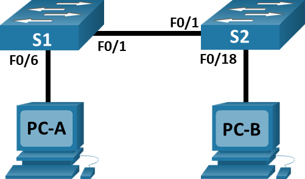
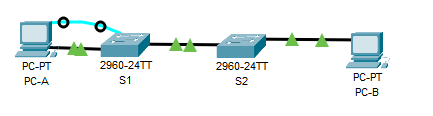
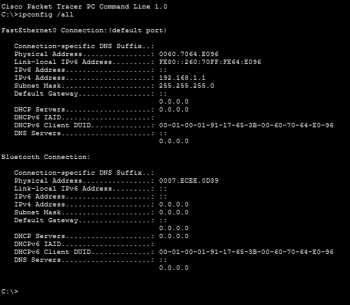
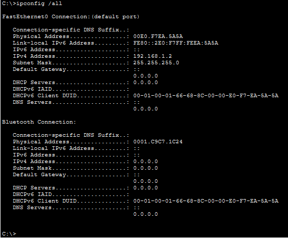
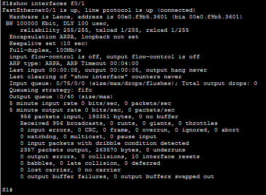
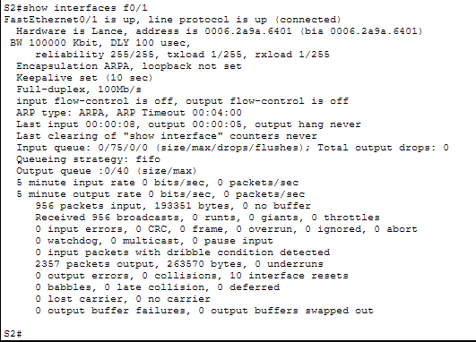
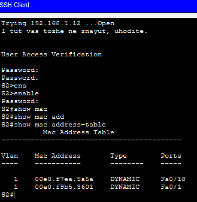
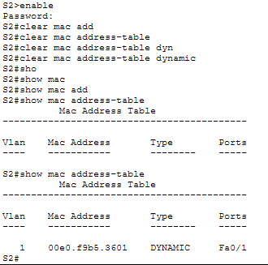
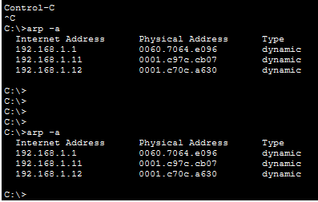

# Лабораторная работа номер 2. Просмотр таблицы MAC-адресов коммутатора 

## Топология
	
## Таблица адресации

|Устройство|Интерфейс|IP-адрес|Маска подсети|
|-|-|-|-|
|S1|VLAN 1|192.168.1.11|255.255.255.0|
|S2|VLAN 1|192.168.1.12|255.255.255.0|
|PC-A|NIC|192.168.1.1|255.255.255.0|
|PC-B|NIC|192.168.1.2|255.255.255.0|


## Цели
- Часть 1. Создание и настройка сети
- Часть 2. Изучение таблицы МАС-адресов коммутатора
## Общие сведения/сценарий
Коммутатор локальной сети на уровне 2 предназначен для доставки кадров Ethernet всем узловым устройствам в локальной сети (LAN). Он записывает МАС-адреса узлов, отображаемые в сети, и сопоставляет их с собственными портами коммутатора Ethernet. Этот процесс называется созданием таблицы МАС-адресов. Получив кадр от ПК, коммутатор изучает МАС-адреса источника и назначения кадра. MAC-адрес источника регистрируется и сопоставляется с портом коммутатора, от которого он был получен. Затем по таблице MAC-адресов определяется МАС-адрес назначения. Если MAC-адрес назначения известен, кадр пересылается через соответствующий порт коммутатора, связанный с этим MAC-адресом. Если MAC-адрес неизвестен, то кадр отправляется по широковещательной рассылке через все порты коммутатора, кроме того, через который он был получен. Важно видеть и понимать работу коммутатора и то, как он осуществляет передачу данных по сети. Понимание функционала коммутатора особенно важно для сетевых администраторов, задача которых заключается в обеспечении безопасной и стабильной работы сети.

Коммутаторы используются для соединения компьютеров в локальных сетях (LAN) и передачи данных между ними. Коммутаторы отправляют кадры Ethernet на узловые устройства, которые идентифицируются по МАС-адресам сетевых плат.

В части 1 вам нужно построить топологию, состоящую из двух коммутаторов. В части 2 вам предстоит отправить эхо-запросы различным устройствам и посмотреть, как два коммутатора строят свои таблицы МАС-адресов.

**Примечание**. В лабораторной работе используются коммутаторы Cisco Catalyst 2960s с операционной системой Cisco IOS 15.2(2) (образ lanbasek9). Допускается использование других моделей коммутаторов и других версий Cisco IOS. В зависимости от модели устройства и версии Cisco IOS доступные команды и результаты их выполнения могут отличаться от тех, которые показаны в лабораторных работах.
**Примечание**: Убедитесь, что все настройки коммутатора удалены и загрузочная конфигурация отсутствует. Если вы не уверены в этом, обратитесь к инструктору.
## Необходимые ресурсы
- 2 коммутатора (Cisco 2960 с операционной системой Cisco IOS 15.2(2) (образ lanbasek9) или аналогичная модель)
- 2 ПК (Windows и программа эмуляции терминала, такая как Tera Term)
- Консольные кабели для настройки устройств Cisco IOS через консольные порты.
- Кабели Ethernet, расположенные в соответствии с топологией

**Примечание**. Интерфейсы Fast Ethernet на коммутаторах Cisco 2960 определяют тип подключения автоматически, поэтому между коммутаторами S1 и S2 можно использовать прямой кабель Ethernet. При использовании коммутатора Cisco другой модели может потребоваться перекрестный кабель Ethernet.

## Инструкции
### Часть 1. Создание и настройка сети
#### Шаг 1. Подключите сеть в соответствии с топологией.

#### Шаг 2. Настройте узлы ПК.
#### Шаг 3. Выполните инициализацию и перезагрузку коммутаторов.
#### Шаг 4. Настройте базовые параметры каждого коммутатора.

- a.	Настройте имена устройств в соответствии с топологией.
```
switch(config)#
switch(config)#hostname S1
S1(config)#
```
- b.	Настройте IP-адреса, как указано в таблице адресации.
```
S1(config)#interfa
S1(config)#interface vlan 1
S1(config-if)#ip address 192.168.1.11 255.255.255.0
S1(config-if)#no shut
S1(config-if)#no shutdown 

S1(config-if)#
```
- c.	Назначьте `cisco` в качестве паролей консоли и VTY.
```
S1(config)#line
S1(config)#line vty
S1(config)#line vty 0 4
S1(config-line)#passw
S1(config-line)#password cisco
S1(config-line)#logi
S1(config-line)#login 
S1(config-line)#exit
```
- d.	Назначьте `class` в качестве пароля доступа к привилегированному режиму EXEC.
```
S1(config)#
S1(config)#servic
S1(config)#service pass
S1(config)#service password-encryption 
S1(config)#enbale secret class
             ^
% Invalid input detected at '^' marker.
	
S1(config)#ena
S1(config)#enable secre
S1(config)#enable secret class
S1(config)#lino
S1(config)#line
S1(config)#line con 0
S1(config-line)#loggi
S1(config-line)#logging syn
S1(config-line)#logging synchronous 
S1(config-line)#banner motd #
Enter TEXT message.  End with the character '#'.
Vy kto takie, ya vas ne znayu. Idite otsyuda. #

S1(config)#
```

И перезагрузка
```
%LINK-3-UPDOWN: Interface Vlan1, changed state to down

%LINEPROTO-5-UPDOWN: Line protocol on Interface Vlan1, changed state to up

S1(config-if)#exit
S1(config)#end
S1#
%SYS-5-CONFIG_I: Configured from console by console

S1#copy
S1#copy run
S1#copy running-config st
S1#copy running-config startup-config 
Destination filename [startup-config]? 
Building configuration...
[OK]
S1#
%LINK-3-UPDOWN: Interface FastEthernet0/1, changed state to down

%LINEPROTO-5-UPDOWN: Line protocol on Interface FastEthernet0/1, changed state to down

S1#
%LINK-5-CHANGED: Interface FastEthernet0/1, changed state to up

%LINEPROTO-5-UPDOWN: Line protocol on Interface FastEthernet0/1, changed state to up

S1#reload
Proceed with reload? [confirm]
C2960 Boot Loader (C2960-HBOOT-M) Version 12.2(25r)FX, RELEASE SOFTWARE (fc4)
Cisco WS-C2960-24TT (RC32300) processor (revision C0) with 21039K bytes of memory.
2960-24TT starting...
Base ethernet MAC Address: 0001.C97C.CB07
Xmodem file system is available.
Initializing Flash...
flashfs[0]: 2 files, 0 directories
flashfs[0]: 0 orphaned files, 0 orphaned directories
flashfs[0]: Total bytes: 64016384
flashfs[0]: Bytes used: 4671719
flashfs[0]: Bytes available: 59344665
flashfs[0]: flashfs fsck took 1 seconds.
...done Initializing Flash.

Boot Sector Filesystem (bs:) installed, fsid: 3
Parameter Block Filesystem (pb:) installed, fsid: 4


Loading "flash:/2960-lanbasek9-mz.150-2.SE4.bin"...
########################################################################## [OK]
Smart Init is enabled
smart init is sizing iomem
                  TYPE      MEMORY_REQ
                TOTAL:      0x00000000
Rounded IOMEM up to: 0Mb.
Using 6 percent iomem. [0Mb/512Mb]

              Restricted Rights Legend
Use, duplication, or disclosure by the Government is
subject to restrictions as set forth in subparagraph
(c) of the Commercial Computer Software - Restricted
Rights clause at FAR sec. 52.227-19 and subparagraph
(c) (1) (ii) of the Rights in Technical Data and Computer
Software clause at DFARS sec. 252.227-7013.
           cisco Systems, Inc.
           170 West Tasman Drive
           San Jose, California 95134-1706
Cisco IOS Software, C2960 Software (C2960-LANBASEK9-M), Version 15.0(2)SE4, RELEASE SOFTWARE (fc1)
Technical Support: http://www.cisco.com/techsupport
Copyright (c) 1986-2013 by Cisco Systems, Inc.
Compiled Wed 26-Jun-13 02:49 by mnguyen
Initializing flashfs...
fsck: Disable shadow buffering due to heap fragmentation.
flashfs[2]: 2 files, 1 directories
flashfs[2]: 0 orphaned files, 0 orphaned directories
flashfs[2]: Total bytes: 32514048
flashfs[2]: Bytes used: 11952128
flashfs[2]: Bytes available: 20561920
flashfs[2]: flashfs fsck took 2 seconds.
flashfs[2]: Initialization complete....done Initializing flashfs.
Checking for Bootloader upgrade..
Boot Loader upgrade not required (Stage 2)
POST: CPU MIC register Tests : Begin
POST: CPU MIC register Tests : End, Status Passed
POST: PortASIC Memory Tests : Begin
POST: PortASIC Memory Tests : End, Status Passed
POST: CPU MIC interface Loopback Tests : Begin
POST: CPU MIC interface Loopback Tests : End, Status Passed
POST: PortASIC RingLoopback Tests : Begin
POST: PortASIC RingLoopback Tests : End, Status Passed
POST: PortASIC CAM Subsystem Tests : Begin
POST: PortASIC CAM Subsystem Tests : End, Status Passed
POST: PortASIC Port Loopback Tests : Begin
POST: PortASIC Port Loopback Tests : End, Status Passed
Waiting for Port download...Complete

This product contains cryptographic features and is subject to United
States and local country laws governing import, export, transfer and
use. Delivery of Cisco cryptographic products does not imply
third-party authority to import, export, distribute or use encryption.
Importers, exporters, distributors and users are responsible for
compliance with U.S. and local country laws. By using this product you
agree to comply with applicable laws and regulations. If you are unable
to comply with U.S. and local laws, return this product immediately.
A summary of U.S. laws governing Cisco cryptographic products may be found at:
http://www.cisco.com/wwl/export/crypto/tool/stqrg.html
If you require further assistance please contact us by sending email to
export@cisco.com.
cisco WS-C2960-24TT-L (PowerPC405) processor (revision B0) with 65536K bytes of memory.
Processor board ID FOC1010X104
Last reset from power-on
1 Virtual Ethernet interface
24 FastEthernet interfaces
2 Gigabit Ethernet interfaces
The password-recovery mechanism is enabled.
64K bytes of flash-simulated non-volatile configuration memory.
Base ethernet MAC Address       : 00:01:C9:7C:CB:07
Motherboard assembly number     : 73-10390-03
Power supply part number        : 341-0097-02
Motherboard serial number       : FOC10093R12
Power supply serial number      : AZS1007032H
Model revision number           : B0
Motherboard revision number     : B0
Model number                    : WS-C2960-24TT-L
System serial number            : FOC1010X104
Top Assembly Part Number        : 800-27221-02
Top Assembly Revision Number    : A0
Version ID                      : V02
CLEI Code Number                : COM3L00BRA
Hardware Board Revision Number  : 0x01

Switch Ports Model              SW Version            SW Image
------ ----- -----              ----------            ----------
*    1 26    WS-C2960-24TT-L    15.0(2)SE4            C2960-LANBASEK9-M

Cisco IOS Software, C2960 Software (C2960-LANBASEK9-M), Version 15.0(2)SE4, RELEASE SOFTWARE (fc1)
Technical Support: http://www.cisco.com/techsupport
Copyright (c) 1986-2013 by Cisco Systems, Inc.
Compiled Wed 26-Jun-13 02:49 by mnguyen


Press RETURN to get started!


Vy kto takie, ya vas ne znayu. Idite otsyuda. 

S1>ena
S1>enable 
Password: 
Password: 
S1#con
S1#conf t
Enter configuration commands, one per line.  End with CNTL/Z.
S1(config)#
S1#
%SYS-5-CONFIG_I: Configured from console by console

S1#
```

### Часть 2. Изучение таблицы МАС-адресов коммутатора
Как только между сетевыми устройствами начинается передача данных, коммутатор выясняет МАС-адреса и строит таблицу.
#### Шаг 1. Запишите МАС-адреса сетевых устройств.
- a.	Откройте командную строку на PC-A и PC-B и введите команду `ipconfig /all`.

**Вопрос**:
Назовите физические адреса адаптера Ethernet.

**Ответ**:
|Узел|MAC|
|-|-|
|PC-A|   Physical Address: 0060.7064.E096|
|PC-B|   Physical Address: 00E0.F7EA.5A5A|

PC-A



PC-B




**Вопрос**:
MAC-адрес компьютера PC-A: 

**Ответ**: 00-60-70-64-E0-96

**Вопрос**:
MAC-адрес компьютера PC-B:

**Ответ**: 00-E0-F7-EA-5A-5A

- b.	Подключитесь к коммутаторам S1 и S2 через консоль и введите команду `show interface F0/1` на каждом коммутаторе.

**Вопрос**:
Назовите адреса оборудования во второй строке выходных данных команды (или зашитый адрес — bia).

**Ответ**:
|Switch|MAC|
|-|-|
|S1|hardware address 00e0.f9b5.3601|
|S2|hardware address 0006.2a9a.6401|




**Вопрос**:
МАС-адрес коммутатора S1 Fast Ethernet 0/1:

**Ответ**: 00-e0-f9-b5-36-01

**Вопрос**:
МАС-адрес коммутатора S2 Fast Ethernet 0/1:

**Ответ**: 00-06-2a-9a-64-01

### Шаг 2. Просмотрите таблицу МАС-адресов коммутатора.
Подключитесь к коммутатору S2 через консоль и просмотрите таблицу МАС-адресов до и после тестирования сетевой связи с помощью эхо-запросов.
- a.	Подключитесь к коммутатору S2 через консоль и войдите в привилегированный режим EXEC.
Откройте окно конфигурации
- b.	В привилегированном режиме EXEC введите команду `show mac address-table` и нажмите клавишу ввода.
```
S2#show mac address-table 
          Mac Address Table
-------------------------------------------

Vlan    Mac Address       Type        Ports
----    -----------       --------    -----

   1    00e0.f7ea.5a5a    DYNAMIC     Fa0/18
   1    00e0.f9b5.3601    DYNAMIC     Fa0/1
S2#
```

Даже если сетевая коммуникация в сети не происходила (т. е. если команда ping не отправлялась), коммутатор может узнать МАС-адреса при подключении к ПК и другим коммутаторам.
**Вопрос**:
Записаны ли в таблице МАС-адресов какие-либо МАС-адреса?

**Ответ**: Да, записаны

**Вопрос**:
Какие МАС-адреса записаны в таблице?

**Ответ**: Записаны MAC адреса соседних узлов, PC-B (00-E0-F7-EA-5A-5A) и S1 (00-e0-f9-b5-36-01)

**Вопрос**: С какими портами коммутатора они сопоставлены и каким устройствам принадлежат? Игнорируйте МАС-адреса, сопоставленные с центральным процессором.

**Ответ**: PC-B сопоставим с портом Fa0/18, S1 сопоставим с портом Fa0/1

**Вопрос**: 
Если вы не записали МАС-адреса сетевых устройств в шаге 1, как можно определить, каким устройствам принадлежат МАС-адреса, используя только выходные данные команды `show mac address-table`?

**Ответ**: Сопоставить устройства физически подключенные в соответствующие порты

**Вопрос**: Работает ли это решение в любой ситуации?

**Ответ**: Нет, иногда нет возможности проверить что физически подключено в Ethernet

### Шаг 3. Очистите таблицу МАС-адресов коммутатора S2 и снова отобразите таблицу МАС-адресов.
- a.	В привилегированном режиме EXEC введите команду `clear mac address-table dynamic` и нажмите клавишу `Enter`.
```
S2>enable
Password: 
S2#clear mac add
S2#clear mac address-table 
S2#clear mac address-table dyn
S2#clear mac address-table dynamic 
```
- b.	Снова быстро введите команду `show mac address-table`.
```
S2#sho
S2#show mac
S2#show mac add
S2#show mac address-table 
          Mac Address Table
-------------------------------------------

Vlan    Mac Address       Type        Ports
----    -----------       --------    -----

S2#
```
**Вопрос**: 
Указаны ли в таблице МАС-адресов адреса для VLAN 1?

**Ответ**: Нет, не указаны

**Вопрос**: Указаны ли другие МАС-адреса?

**Ответ**: Нет, не указаны

**Вопрос**: 
Через 10 секунд введите команду `show mac address-table` и нажмите клавишу ввода. Появились ли в таблице МАС-адресов новые адреса?

**Ответ**: Да, появился
```
S2#show mac address-table 
          Mac Address Table
-------------------------------------------

Vlan    Mac Address       Type        Ports
----    -----------       --------    -----

   1    00e0.f9b5.3601    DYNAMIC     Fa0/1
S2#
```

### Шаг 4. С компьютера PC-B отправьте эхо-запросы устройствам в сети и просмотрите таблицу МАС-адресов коммутатора.
- a.	На компьютере PC-B откройте командную строку и еще раз введите команду `arp -a`.
```
C:\>arp -a
No ARP Entries Found
C:\>
```
**Вопрос**: 
Не считая адресов многоадресной и широковещательной рассылки, сколько пар IP- и МАС-адресов устройств было получено через протокол ARP?

**Ответ**: Всего было получено 3 пары IP-MAC

- b.	Из командной строки PC-B отправьте эхо-запросы на компьютер PC-A, а также коммутаторы S1 и S2.
```
C:\>ping 192.168.1.1

Pinging 192.168.1.1 with 32 bytes of data:

Reply from 192.168.1.1: bytes=32 time<1ms TTL=128
Reply from 192.168.1.1: bytes=32 time<1ms TTL=128

Ping statistics for 192.168.1.1:
    Packets: Sent = 2, Received = 2, Lost = 0 (0% loss),
Approximate round trip times in milli-seconds:
    Minimum = 0ms, Maximum = 0ms, Average = 0ms

Control-C
^C
C:\>ping 192.168.1.11

Pinging 192.168.1.11 with 32 bytes of data:

Request timed out.
Reply from 192.168.1.11: bytes=32 time<1ms TTL=255
Reply from 192.168.1.11: bytes=32 time<1ms TTL=255
Reply from 192.168.1.11: bytes=32 time<1ms TTL=255

Ping statistics for 192.168.1.11:
    Packets: Sent = 4, Received = 3, Lost = 1 (25% loss),
Approximate round trip times in milli-seconds:
    Minimum = 0ms, Maximum = 0ms, Average = 0ms

C:\>ping 192.168.1.12

Pinging 192.168.1.12 with 32 bytes of data:

Reply from 192.168.1.12: bytes=32 time<1ms TTL=255
Reply from 192.168.1.12: bytes=32 time<1ms TTL=255
Reply from 192.168.1.12: bytes=32 time<1ms TTL=255
Reply from 192.168.1.12: bytes=32 time<1ms TTL=255

Ping statistics for 192.168.1.12:
    Packets: Sent = 4, Received = 4, Lost = 0 (0% loss),
Approximate round trip times in milli-seconds:
    Minimum = 0ms, Maximum = 0ms, Average = 0ms

C:\>arp -a
  Internet Address      Physical Address      Type
  192.168.1.1           0060.7064.e096        dynamic
  192.168.1.11          0001.c97c.cb07        dynamic
  192.168.1.12          0001.c70c.a630        dynamic

C:\>
```
**Вопрос**: 
От всех ли устройств получены ответы? Если нет, проверьте кабели и IP-конфигурации.

**Ответ**: Да, ответы получены от всех, но на некоторых потерялся первый реквест

- c.	Подключившись через консоль к коммутатору S2, введите команду `show mac address-table`.
```
S2#show mac address-table 
          Mac Address Table
-------------------------------------------

Vlan    Mac Address       Type        Ports
----    -----------       --------    -----

   1    0001.c97c.cb07    DYNAMIC     Fa0/1
   1    0060.7064.e096    DYNAMIC     Fa0/1
   1    00e0.f7ea.5a5a    DYNAMIC     Fa0/18
   1    00e0.f9b5.3601    DYNAMIC     Fa0/1
S2#
```
**Вопрос**: 
Добавил ли коммутатор в таблицу МАС-адресов дополнительные МАС-адреса?

**Ответ**: Да, добавил

**Вопрос**: 
Если да, то какие адреса и устройства?

**Ответ**: Добавил PC-A с адресом 00-60-70-64-E0-96, PC-B с адресом 00-E0-F7-EA-5A-5A, и S1 с адресом 00-01-C9-7C-CB-07


На компьютере PC-B откройте командную строку и еще раз введите команду `arp -a`.

**Вопрос**:
Появились ли в ARP-кэше компьютера PC-B дополнительные записи для всех сетевых устройств, которым были отправлены эхо-запросы?

**Ответ**:  Да, ARP-таблицу с компьютера PC-B выкладывал чуть выше.



## Вопрос для повторения
**Вопрос**: В сетях Ethernet данные передаются на устройства по соответствующим МАС-адресам. Для этого коммутаторы и компьютеры динамически создают ARP-кэш и таблицы МАС-адресов. Если компьютеров в сети немного, эта процедура выглядит достаточно простой. Какие сложности могут возникнуть в крупных сетях?

**Ответ**: Проблем сеьма много:
- Ограниченый размер MAC таблиц. При переполнении начнется flood кадров во всеп орты
- Избыточный ARP трафик, особено если в сети есть камеры, принтеры и телефоны (ARP-spoofing)
- Дополнительные обращения к памяти, имеющий ограниченый цикл, при переподключении устройств из одного порта коммутатора в другой
- Высока вероятность появления петель и срабатывания STP/RSTP для отрезания этих петель
